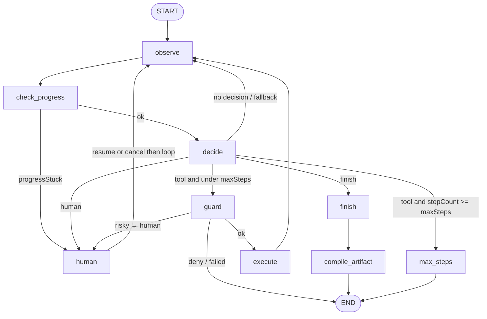

## 1. Architecture

Discovery runs are orchestrated with LangGraph.

The core browser-interaction nodes are **OBSERVE**, **DECIDE**, and **EXECUTE**.

- **OBSERVE** captures the current browser state using both Playwright MCP and CDP.
- **DECIDE** is the model-driven node. It produces one of three outcomes: a tool call, a human request, or FINISH.
- **GUARD** deterministically evaluates proposed actions before execution. It intercepts credential/login interactions and actions covered by safety or HITL policy rather than leaving those decisions to the LLM.
- **EXECUTE** performs the approved browser action.
- **CHECK_PROGRESS** runs outside model reasoning and detects repeated mutations that are not producing meaningful browser-state changes.
- **COMPILE_ARTIFACT** runs after successful discovery and converts the completed run into the reusable deterministic workflow artifact.
### Getting Browser Elements

Playwright MCP is the main execution layer for browser actions such as click, type, select, navigation, and keyboard input. Its accessibility snapshots provide the fresh element refs used for those actions.

In some cases, the accessibility snapshot did not expose enough structure to reliably distinguish the exact control. For example, while testing 2 + 3 on calculator.net, the keypad could be represented as a larger container containing several buttons. The agent could see the relevant symbols, but sometimes selected the wrong element instead of the 2 button. To improve this, I added CDP as a second perception channel. CDP gives more detailed DOM and element metadata, which helps identify the intended control more accurately. CDP is only used for perception; the actual browser action is still executed through MCP using a fresh ref from the current snapshot.

### Abstracting Those Details

A `BrowserController` abstraction separates browser execution from agent orchestration, while a `ToolRegistry` defines the actions available to the model. I defined 10 tools including click, go back, hover, inspect dom, inspect element, navigate, press-key, select, scroll and type. I believe these would cover all the cases. RUSK uses one visible Chromium browser session. Discovery, replay, and human take turns using it so they do not interfere with each other.

### Deciding the Action

The `OBSERVE` node combines the current browser state from Playwright MCP and CDP and passes that context to the LLM. The `DECIDE` node, which is the only model-driven node, uses the user’s goal, the latest browser state, and recent action history to choose exactly one next step: execute a tool, request human intervention, or finish the run. Only one browser mutation is allowed per decision.

### Guards

If the model chooses a tool, the action first passes through `GUARD` for deterministic policy checks before reaching EXECUTE. After execution, control returns to `OBSERVE` so the next decision is always based on fresh browser state. `GUARD` is also where human intervention us triggered. Credential-related, and actions that require explicit approval are routed to human instead of being executed automatically. For the prototype, approval rules are intentionally explicit and hardcoded:

```ts
export const APPROVAL_REQUIRED: ApprovalRule[] = [
  {
    name: "Close account",
    reason: "Account closure is irreversible",
  },
];
```

This means that if the model proposes clicking `Close account`, the guard does not rely on the LLM to decide whether that action is safe. It deterministically routes the run to human.

### TRACKING PROGRESS

`CHECK_PROGRESS` maintains recent normalized browser states and action history.The system keeps a short history of recent browser states and recent actions. After each interaction, it checks whether the page has actually changed in a meaningful way. If several state-changing actions lead back to effectively the same browser state, the run is treated as stuck and handed over to human. 

The discovery loop also has a fixed maximum number of steps, so it cannot continue indefinitely even if the model keeps proposing new actions. The model decides whether the user’s goal is complete, while stuck detection and execution limits are handled deterministically.




In hindsight, some deterministic stages did not need to be separate LangGraph nodes; I simply used them for explicit routing and traceability.

## 2. Artifact schema

A successful discovery run is compiled into a versioned JSON artifact. The artifact is a reusable artifact contract rather than a raw trace of the LLM run.

Each artifact contains:

- **metadata** - `id`, `version`, `name`, `description`, and `sourceRunId`
- **entry state** - `startUrl` and authentication requirements
- **inputs** - typed invocation parameters
- **steps** - ordered deterministic actions
- **targets** - semantic element descriptors
- **outputs** - typed values extracted from the result page
- **conditions** - known business or recoverable outcomes
- **checkpoint** - the success condition for the workflow

For example, the `close_account` artifact takes an account identifier as an input:

```json
"account_id_query": {
  "type": "string",
  "required": false,
  "description": "Account ID"
}
```

The input is referenced structurally inside the replay steps.

```
{
  "action": "type",
  "target": {
    "testId": "search-input",
    "role": "searchbox",
    "placeholder": "e.g. CK-1001"
  },
  "value": {
    "source": "input",
    "name": "account_id_query"
  }
}
```

The compiler marks discovered fields as optional so a single artifact can represent a family of closely related workflows. For example, editing a member’s email, address, or phone number follows the same workflow, so it would be wasteful to record three separate runs. During discovery, the system tracks relevant searchable and editable fields as potential inputs; user then input only the fields needed for that particular run.

During discovery, the LLM decides when the user’s goal has been completed based on the current browser state. Once the run is marked complete, that observed success condition is compiled into the artifact as a deterministic checkpoint.

```
  "checkpoint": {
    "kind": "text_present",
    "text": "Account closed"
  },
```


## 3. Determinism & Error Handling

Replay is fully separate from the LangGraph discovery loop. When a URL is entered in the RUSK UI, the application shows the workflows saved for that URL. The user selects a workflow and fills in the input fields exposed by the artifact.

The replay engine receives the saved artifact together with those input values. The artifact defines the ordered steps, semantic targets, expected checkpoint, known conditions, and outputs to extract. The outputs are part of the replay result and are reviewable, although they are not currently displayed in the UI.

### Input Validation

The first failure mode is invalid input. Before browser execution starts, the artifact is validated and any required input fields are checked. If a required value is missing, replay returns an `input_invalid` failure and the browser run does not start. This avoids beginning a workflow when the artifact already knows it does not have enough information to complete it.

### Policy Guardrails

Replay also passes actions through the same deterministic policy layer used to protect discovery. The policy can allow an action, require human intervention, or block it completely. For example, if replay attempts to navigate to an origin outside the configured allowlist, it returns `origin_blocked` and stops as a hard failure. If an action type is explicitly blocked, replay returns `action_blocked`.

### Success

Replay executes the artifact step by step without asking the LLM what to do next.

Targets are resolved against the current browser state on every step. Old MCP refs are never persisted or reused. Instead, the artifact stores semantic target information and replay resolves that target to a fresh ref before each action. This allows replay to continue even after navigation, page updates, or human intervention.

When exactly one target is resolved, the recorded action is executed using the inputs supplied from the UI. Replay does not consider the workflow successful simply because all actions ran. The final checkpoint must also be present. For example:

```json
"checkpoint": {
  "kind": "text_present",
  "text": "Account closed"
}
```

Only after the checkpoint passes are the explicitly declared outputs extracted and the replay marked as successful.

### No Target Found

A more difficult case is when replay cannot find the expected target. Replay cannot safely infer the meaning of that state without bringing model reasoning back into the production path. To handle this, I made known outcomes part of the artifact contract. The LLM discovers the workflow steps, while the expected business outcomes are added after reviewing the artifact.

```
"conditions": [
  {
    "code": "member_not_found",
    "class": "business_outcome",
    "message": "No matching member was found.",
    "when": {
      "kind": "text_present",
      "text": "No members"
    }
  }
]
```

If no declared condition matches and the expected target is still missing, the state is treated as recoverable rather than guessed at. 

### Ambiguous Targets

It is also possible for more than one element to match the same semantic target. For example, a search results page may contain several `View Member` links with the same role and accessible name. Replay uses additional context such as the surrounding result container and the supplied input value to narrow the match. If it still cannot resolve the target to exactly one element, it returns `target_ambiguous` instead of arbitrarily choosing one.

In either of the two cases, if it deems recoverable, replay first tries a small number of deterministic recovery strategies. For example, detecting whether the workflow has already moved past the current step. If those do not work, the run is handed to human. Internally, they are classified as `recoverable`, but the user sees `waiting for human`. 

### Human Intervention

When replay reaches a recoverable or approval-required state, the run is paused and control of the same live browser session is transferred to human. The current replay state is preserved, including the artifact, inputs, step index, and failure context. 

For a normal recoverable failure, the operator fixes the browser state and resumes the run. Replay then retries the same step using a fresh browser observation and fresh target resolution. The workflow therefore does not restart from the beginning, and stale MCP refs are never reused. 

For an approval-required action, the current implementation assumes that the human performs the gated action manually. On resume, replay continues from the next step instead of automatically repeating the blocked action. 

## 4. Heterogeneity & Multi-Tenant

Although the prototype is built against one browser-based application, I tried to keep the workflow representation separate from the specific automation technology used to execute it. The goal was to avoid baking assumptions about one DOM structure or one browser tool directly into the artifact.

### Heterogeneity

The current version only works with browsers, but the artifact itself is not tied to Playwright or CSS selectors. It stores higher-level actions and targets, while `BrowserController` decides how to find and interact with them. That means the same artifact format could later work with a harder legacy web app using accessibility data, DOM structure, frames, tables, or coordinates. A desktop version could use the same idea with OS accessibility or desktop automation instead.

### Multi-Tenant

For each implementation, each transaction would have a single artifact. A system to manage these artifacts would be required. It could could expose URLs, targets, conditions, checkpoints, and policy settings without requiring someone to edit JSON directly. When onboarding another tenant, this becomes the starting point. The tenant can then keep its own version and change the parts that are different for its application if necessary. 

Each new artifact would start with a discovery run. The LLM would produce the initial happy-path artifact.. We would then test the workflow across different scenarios and collect the possible outcomes for that artifact, such as business outcomes, ambiguous states, approval cases, and failures. Those results can then be added back into the artifact as rules & the reviewed artifact becomes the version used for replay. It would need a more robust merging mechanism for it though.

Since policies for risky transactions (where a human's intervention is needed) is separated, it can be versioned for each client. Persisting this per tenant should be possible. Artifacts and policy configuration can be stored under a tenant ID in separate database records. The replay engine receives the artifact and policy that apply to the current tenant.

One scenario where this design would probably need more work is multi-region. Some UI differences are easy to handle if the application has stable attributes such as button IDs, test IDs, or consistent routes. So navigating those should be fairly simple. But if the artifact has to rely on visible text or accessible names, the same artifact need a separate artifact version for that deployment. 

For error codes, which usually map more directly to business outcomes, the tenant could use the existing database or catalogue where frontend and backend error codes are already defined. From my experience working in a legacy banking system, the error codes are the same for the base product, only the description changes for a teller in Saudi National Bank vs Zions Corporation. My idea is to exploit those. While my prototype uses simple text matching such as No members, a production version could match an error code instead. That would proabably make it more reliable. If these structured codes can be used directly, it would also reduce the number of cases where stopping conditions need to be manually hardcoded into individual artifacts. It could also make it easy to identify unrecoverable software failures as those are labelled with different codes.

## 5. Escalation & Handoff

Human intervention happens in the same live browser session. RUSK owns the headed Chromium session through the browser-control laye. CDP continues to observe that same browser state while control changes between human and the browser agent.

A handoff does not open a new browser as the current run state is preserved, The human works directly in the browser where automation stopped, and control is later returned. The only caveat in the current prototype is that this handoff is not fully seamless: after completing the manual work, the human has to return to RUSK and explicitly resume the replay.

The human gets involved in the following cases

- The LLM can choose HUMAN instead of proposing another tool action. I treated this mainly as a fallback for uncertainty. For example, if I type "issue a cheque book for priya nair", and there are multiple kinds of cheque books, instead of booking the standard one, the LLM should wait for human clarification. If the human selects an option, the discovery returns through OBSERVE, so the next decision is made from the current browser state rather than from the state that existed before the handoff.  All the editable fields are captured.
- I chose not to pass any credentials through the normal LLM and tool history, so the guard pauses automation to prompt the user to login. The human enters the username and password & clicks sign in directly into the same live browser. Once control is returned, OBSERVE node of the graph invokes observation the resulting page and continues from there.This is enforced by a credential guard.
- Safety-sensitive decisions should not be left to the LLM. The model proposes an action, but GUARD decides whether it can actually be executed. In the current version, these approval rules are hardcoded. For example, `close account` is explicitly treated as an irreversible action that requires human in the loop. A policy denial is different: an action that is completely blocked fails rather than being handed to human. This works in both LLM discovery run and replay.
- If repeated state-changing actions keep producing the same browser state, the run is treated as stuck and handed to HUMAN instead of allowing the LLM to loop indefinitely. After the human repairs the state, a fresh observation is invoked again.
- In replay, a human is only involved after small deterministic recovery strategies have been tried and failed, or when policy explicitly requires human approval. For a recoverable failure, the human can dismiss an unexpected dialog, restore authentication, or correct the current browser state. After the human returns to RUSK and resumes replay, automation takes control of the same run and browser again, observes the current page, and retries the same step with a fresh target. In approval-policy based automation, the automation continues from next step.


## 6. Safety

During discovery, every tool decision passes through GUARD before EXECUTE. The LLM can propose an action, but it should not be the final authority on whether that action is allowed to run. The prompt contains soft safety rules, however, the actual enforcement happens in code. If a hard policy check fails, the action is never executed.

The guards limits what the agent can do at all. Only a small browser toolset is exposed, and actions outside that fail. Navigation is restricted to a few configured origins. The model cannot simply follow a prompt to an arbitrary domain.

Credentials are handled separately: if the system detects that the agent is about to type into an authentication field, the action is redirected to human so passwords, PINs, or OTPs are safe.

For risky actions, the current prototype uses explicit approval rules. For example, close account is hardcoded as requiring human intervention because it is irreversible. Replay runs through the same policy checks, so saving an artifact does not bypass the guardrails later.

The main limitation is that the current guardrail system only handles the risky actions I have explicitly defined well. For example, Close account is hardcoded to require HUMAN approval, but the broader risk classifier is not yet used as a full authorization system. That means a new risky action would need to be added to the policy before I could rely on it being blocked or escalated consistently.

Another limitation is that some rules depend on UI text. A rule based on Close account may stop working if another tenant uses a different label or another language. A production system should use stable semantic action names or transaction codes instead of button text.

The credential and evidence protections also have limits. RUSK prevents credentials from going through the normal typing path and redacts sensitive values from logs, but the browser observation layer can still see ordinary field values and labels. 

## 7. Cuts

- I think the biggest cut I made was relying too much on hardcoded actions. The clearest example is approval-based policy. My system does not yet have a general mechanism to reliably identify every action that should require HUMAN intervention, so some approval rules are explicitly defined in advance. Conditions in the artifact also need to be updated manually.This works for the prototype, but it means known business outcomes have to be added separately.

- One more cut I made was treating editable fields naively when generating artifact inputs For example, in `update_information`, `member_id` may be required to identify the member, while `email`, `phone_number`, and `address` should remain optional because the user may only want to update one of them. Ideally identifying, this would use a more sophosticated mechanism but for now, I made everything optional.

- Right now, success is verified by checking whether some expected text is present. A stronger system would verify the actual business effect of the action. For example, after issuing a cheque book, it could verify that the relevant transaction or account history was updated correctly rather than only checking for a success message. Doing this reliably would better checkpoint definitions and better discovery of what evidence should be used to confirm success.


I would probably work on the above problems next.